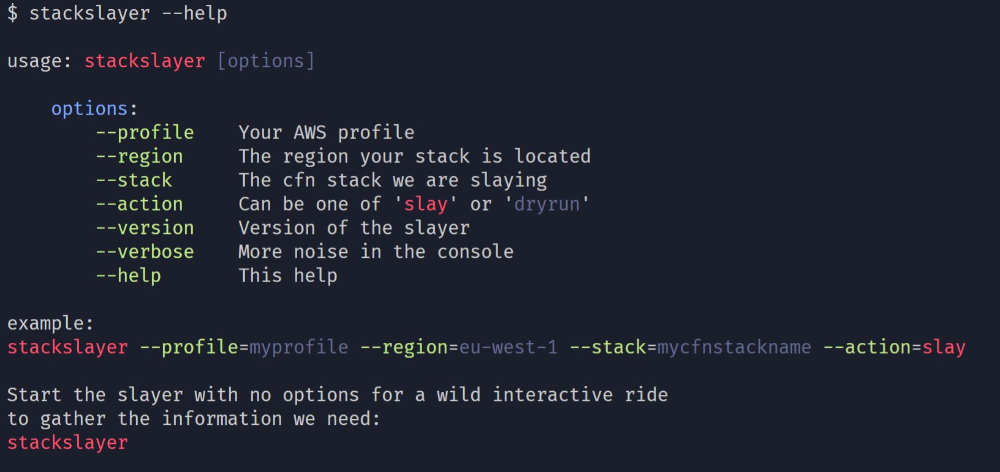

# ⚔ Stack Slayer 🥞

## An attempt to take care of all the problems you have when tearing down an AWS CloudFormation stack


> 😱 What do we do when we see `DELETE_FAILED`?<br>Dig hard, dig deep, go for shelter, and never look back.

⚠⚠⚠ WARNING: This is not even slightly working right now. Do not even try to use it for any purpose at all.



### What is in:

- Serious effects with comedy causes
- Interactive menus to choose a stack
- AWS SDK working
- Stripping bucket contents before delete
- Actual stack delete

### What is not working yet:

- Delete API Gateway base path mapping
- Unit tests
- Providing details in command line for CI/CD


## Run it

```sh
npm i stackslayer -g
stackslayer
```

## Develop it

```sh
git clone git@github.com:leenattress/stackslayer.git
cs stackslayer
npm i
npm link
stackslayer
```